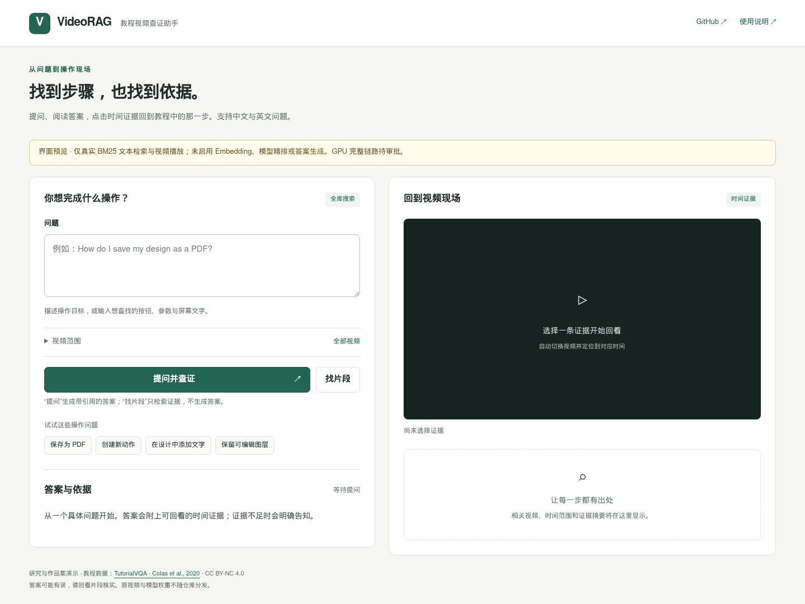
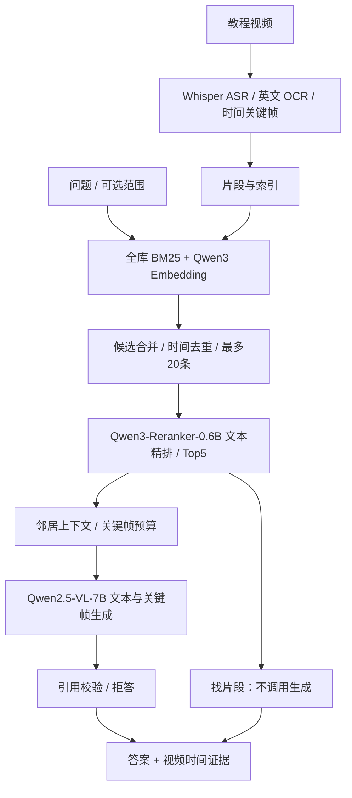

# VideoRAG · 教程视频查证助手

帮助学习软件操作的人，从一句问题找到操作步骤、屏幕细节和可点击的时间证据。



**当前状态（2026-09-27）：** 页面、真实 BM25 检索与视频跳转已验收；新全库 GPU 问答和指标仍待学校作业 **19048** 审批。截图是运行中的 **CPU 预览**，不是模型生成答案。[手机截图](docs/media/workspace-mobile.png) · [逐项验收](reports/portfolio/ACCEPTANCE.md)。完整问答录屏尚未完成，见 [演示步骤](docs/DEMO.md)。

## 三步完成一次任务

1. **输入问题**：例如 “How do I save my design as a PDF?”；默认搜索全部 76 个教程，可主动限定视频。
2. **阅读并查证**：“提问”生成带引用的答案；只需定位时用“找片段”，不调用生成模型。证据不足则拒答。
3. **回到操作现场**：点击引用或播放按钮，切换到对应视频和时间；展开 ASR/OCR 核实步骤。

## 我的实现与产品取舍

围绕“找到并核实一步操作”，实现 Flask 工作台、检索/精排/生成编排、视频范围约束、引用校验和时间定位，并区分视频内检索、跨视频检索和问答样本的评测口径。

- 默认全库搜索，避免提前提供正确视频 ID；主动限定范围在召回 Top-K **之前**生效。
- 答案与视频并列，便于复核；无效引用、低置信度或证据不足时拒答。
- “找片段”与“提问”分开，减少不必要的生成；显示真实耗时，不编造阶段进度。
- 复用原生 HTML/CSS/JavaScript 和 Flask，不扩展为视频平台、多租户或复杂 Agent。

[产品案例：用户假设、MVP、指标与实际失败](docs/PRODUCT_CASE.md)

## 架构与职责



精排读取 **ASR、OCR 和已有视觉描述文本**，不直接读取图片；Qwen-VL 在生成阶段读取图片。文字问题可追加 OCR BM25，画面问题可追加 English CLIP。当前 76 视频采用 20 秒窗口、5 秒重叠和每 5 秒关键帧，未生成视觉描述；支持字段不代表本批数据已具备。候选采用轮询并集，不混加不同检索器原始分数。

| 模块 | 实现 |
|---|---|
| 数据预处理 | [prepare_tutorialvqa_scale.py](scripts/prepare_tutorialvqa_scale.py)、[tutorial_ocr_scale.py](scripts/tutorial_ocr_scale.py) |
| 编排与范围过滤 | [pipeline.py](src/video_rag/pipeline.py) |
| API 与页面 | [api](src/video_rag/api) |
| 全库配置 | [config.tutorialvqa.full-demo.toml](config.tutorialvqa.full-demo.toml) |
| 评测 | [evaluate_tutorialvqa_global.py](scripts/evaluate_tutorialvqa_global.py) |

## 实际结果与边界

| 实验 | 数据与口径 | 已有结果 |
|---|---|---|
| 历史视频内片段检索 | 76 视频、官方 Test 1,239 问；已传正确视频 ID；Top-5 | Recall@5 **92.17%** |
| 历史 5 视频问答 | Test 55 问；已知视频范围 | 平均 **3.477 秒**，中位数 3.229 秒，P95 5.723 秒 |
| 新全库真实模型评测 | 19048 待审批；计划 1,239 问检索、30 问生成样本 | **尚无结果** |
| 浏览器验收 | 真实 76 视频 BM25 预览；1440/390px | 检索、范围约束、视频切换与定位通过 |

历史 Recall 不是跨视频召回或精排收益；3.48 秒不是新全库端到端延迟。时间命中按“同视频且与官方答案区间正长度重叠”，不等于精确定位。历史问答计时不含浏览器或网络。[历史问答详细报告](reports/tutorialvqa/2026-09-20/full-evaluation.md) · [历史检索原始报告](reports/portfolio/historical-scoped-test.json)。

新评测分别记录视频 Recall@1/5、时间片段 Recall@1/5、候选池 Recall@20、**同一冻结候选池**精排前后对比、答案 Token F1、引用有效率、证据命中率和平均/中位数/P95 延迟。先预热召回、精排与生成；排除初次加载、网络和网页渲染。30 问只是问答样本。引用合法不等于内容正确，仍需人工看片核实。[协议](docs/TUTORIALVQA_FULL_DEMO.md)

## 快速启动

真实推理需要 Python 3.10+、FFmpeg、NVIDIA GPU、模型缓存与处理后视频。GitHub 静态页面不能运行推理。学校使用 A100；其他环境建议 24GB+ 显存、64GB RAM、100GB 磁盘起步，实际峰值需实测。

```bash
cd /data/zzhu126/VideoRAG
source env.school.sh
squeue -j 19048
scontrol show job 19048  # 不重复提交既有评测
# 需要真实服务时单独申请服务作业，仍需批准
sbatch scripts/run_tutorial_full_demo.school.sbatch
# CPU 预览：真实 BM25 与播放，提问返回明确 503
python scripts/run_ui_preview.py --port 5001
```

本机复用已认证连接：

```bash
ssh -S /tmp/videorag-ssh -O forward \
  -L 15001:127.0.0.1:5001 zzhu126@foscsmlprd01.its.auckland.ac.nz
# 打开 http://127.0.0.1:15001
```

[学校命令、Slurm 日志、GPU 启动与其他环境复现](docs/RUNBOOK.md)

## 来源、许可、限制与后续

数据来自 [TutorialVQAData](https://github.com/acolas1/TutorialVQAData)，Colas et al., LREC 2020，数据集许可 **CC BY-NC 4.0**。保留署名，仅作非商业研究演示；不提交原视频、权重、索引、缓存、服务器日志或认证信息。

公开 PNG 来自本项目运行中的页面，拍摄于播放前，不含原视频帧；第三方教程画面的公开录屏授权未单独确认。[素材说明](docs/media/README.md)

尚未验证全库模型效果、中英文跨语言效果和用户节省时间比例。ASR/OCR 可能有误，引用校验不保证事实正确；无用户访谈、线上用户或留存数据。下一步优先补真实 GPU 问答、失败分析和用户任务测试。旧配置和研究材料保留在 [技术档案](docs/TECHNICAL_ARCHIVE.md)，不作为当前默认展示。
